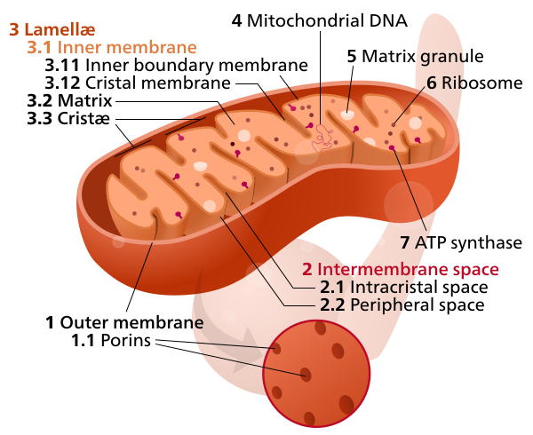
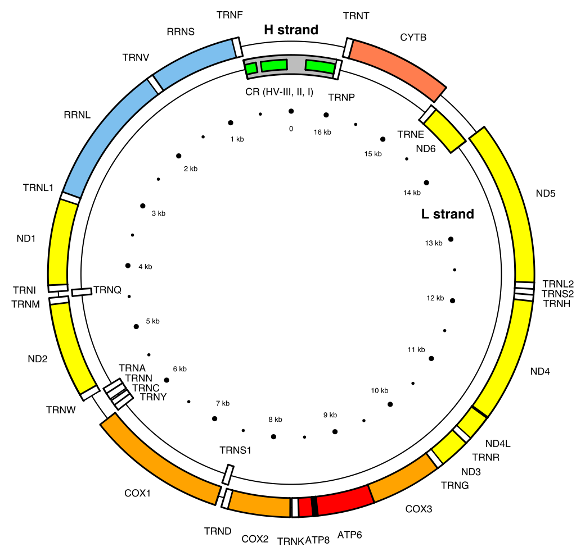

<!-- adding bold and italic options -->

## Ancient DNA

- Mitochondrial phylogenetics
- Ancient DNA
- Sabretooth cats
- Sequencing the North Sea *Homotherium*

--- .class #id

## Paijmans et al. 2017

<embed src="./assets/img/Paijmans et al. - 2017.pdf" title="plot of chunk unnamed-chunk-2" alt="plot of chunk unnamed-chunk-2" width="100%" height="500" type="application/pdf" />

--- .segue .dark 

## Mitochondrial phylogenetics

--- &twocol bg:white

## You've probably seen diagrams like this...

### This is called a `phylogeny`. It represents the evolutionary process

*** =right

*** =left

- The phylogeny works like an evolutionary tree
- The tips are species
- The branches show their relationships
- Nodes represents common ancestors, from which new species evolved
- Generally, phylogenies are calculated using **genetic data**

--- .class #id

## Inheritance plus mutation

- Errors in DNA replication (mutations) change the DNA sequence
- Human mutation rate is ~1.1×10−8 mutations per site per generation
- This means you carry ~40 mutations in your 3.6 Gb genome
- These differences are inherited by offspring
- Sequence divergence and time are (approximately) linearly related

### Phylogenetics works in reverse: we observe the DNA sequences and try to work out the tree that generated them

--- .class #id

## DNA sequence alignment

--- .class #id

## Mitochondrial DNA is great for phylogenetics!

--- &twocol

## Mitochondrial DNA is great for phylogenetics!

*** =right

*Emmanuel Douzery, CC BY-SA 4.0*

*** =left

- Mitochondrial genome ~16 kb
- 13 protein-coding genes, 2 rRNAs and 22 tRNAs
- High mutation rate
- No recombination
- High copy number per cell
- Maternally inherited

--- .class bg:white

--- .segue .dark 

## Ancient DNA

--- .class #id

## Ancient DNA is just old DNA

--- .class #id

## Some samples don't fit in the lab!

--- &vcenter

## Timeline of ancient DNA

--- .class #id

## Study species

*Glyptodont, WolfmanSF, CC BY_SA 3.0*

--- .class #id

## What are the challenges?

--- .class #id

## Ancient DNA work is contamination sensitive

--- .class #id

## Ancient DNA work is contamination sensitive

--- &vcenter

## But the samples are already highly contaminated

--- .segue .dark 

## Sabretooth cats

--- &twocol

## There were two genera of sabretooth cats

- **A genus us a group of closely related species. It's the first part of the scientific name**
- **e.g. Homo sapiens**

*** =left

### Smilodon

- The most commonly known group
- Massive canines
- > 400 kg and 120 cm shoulder height
- N and S America
- 3 species, *S. gracilis, S. populator, S. fatalis*
- Extinction 10 ka

*** =right

--- &twocol

## There were two genera of sabretooth cats

- **A genus us a group of closely related species. It's the first part of the scientific name**
- **e.g. *Homo sapiens*)**

*** =left

### Homotherium

- Less known group
- Also known as scimitar-toothed cats
- Flat, serrated canines
- ~ 200 kg and 110 cm shoulder height
- Europe, Africa, N and S America
- Europe: *H. latidens*, extinction 300 ka
- N. America: *H. serum*, extinction 12 ka

*** =right

*Sergiodlarosa, CC BY-SA 3.0*

--- .class #id

## *Homotherium* skull

*Ghedoghedo, CC BY-SA 4.0*

--- &twocol

## Fishing for fossils

*** =left

- Britain connected to mainland Europe by an area called **Doggerland**
- Rising sea levels 6-7 ka flooded the area, making Britain an island

*** =right

*Max Naylor, CC BY-SA 3.0*

--- &vcenter

## 16th March 2000, something surprising turned up...

### This didn't look like a 300 ka fossil

--- .class #id

## Analysis of the Dutch North Sea *Homotherium*

### Dating

 >- The bone was radiocarbon dated at 31,300 ± 400!
 >- This was extraordinary, so the dating was repeated:
  + 31,300 ± 400
  + 26,900 ± 400
  + 26,700 ± 240
  + 28,100 ± 220
  + 27,650 ± 280

>- The first Late Pleistocene European *Homotherium*

--- .class #id

## Analysis of the Dutch North Sea *Homotherium*

### Ancient DNA

- A sample was taken in 2006 by Prof. Michi Hofreiter
- Some tiny sequences were recovered, but they were too short to provide conclusive results...

--- .segue .dark 

## Sequencing the North Sea *Homotherium*

--- &twocol

## By 2014 the technology had improved substantially

*** =left

- Widespread adoption of Next Generation Sequencing by the aDNA community
- Improved DNA extraction methods
- Improved library preparation methods
- A targeted sequencing technique called **DNA hybridisation capture**

*** =right

- Michi gave the sample to his PhD student, Johanna Paijmans, to try again

--- &vcenter

## Initial sequencing showed extremely high contamination

--- &twocol

## DNA hybridisation capture

### "Fishes" mitochondrial fragments from the contaminated ancient DNA

*** =left

- DNA has 2 strands, arrange in a double helix
- It can be heat denatured
- When cooled, the single strands will stick (hybridise) to strands with a similar sequence
- Manufacture "bait" sequences that match your target region
- Use to capture these sequences from the contaminants

*** =right

*Magladem96, CC BY-SA 3.0*

--- &vcenter

## DNA hybridisation capture

### This only works if you know the sequence in advance

--- &twocol

## Meanwhile a Danish group were sequencing North American cave lion mtDNA

*** =right

*** =left

- Sequence analysis showed it was actually a *Homotherium*
- They provided the sequence and Johanna ordered the hybridisation cature baits

--- &vcenter

## The hybridisation capture worked!

--- .class #id

## Phylogenetic analysis of sabretooth cats

--- .class #id

## The final step: molecular dating

- Molecular phylogenies are scaled to genetic divergence
- We know genetic divergence and time are linearly related

### If we know some of the divergence times, we can scale the tree to time

--- .class #id

## Phylogenetic analysis of sabretooth cats

--- .class #id

## Molecular dating of sabretooth cats

- Sabretooths divergence from living cats 20 Ma
- *Homotherium* and *Smilodon* were more diverged from one another than any living cats
- A huge diversity was lost with the extinction of the sabretooths
- North American and European *Homotherium* were genetically similar
- We recommended they be treated as a single species, *H. latidens*

--- .class #id

## Paijmans et al. 2017

<embed src="./assets/img/Paijmans et al. - 2017.pdf" title="plot of chunk unnamed-chunk-31" alt="plot of chunk unnamed-chunk-31" width="100%" height="500" type="application/pdf" />

--- &thankyou

## Ancient DNA

**An exciting and dynamic field driven by technological advances**

